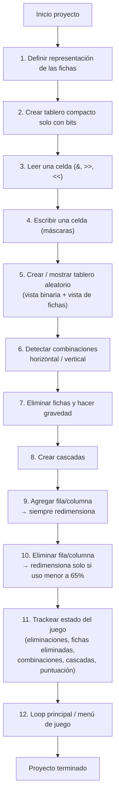

# Esquema de tareas — Sweet Crush

```mermaid
flowchart TD
    A[Inicio proyecto] --> B["1. Definir representación de las fichas"]
    B --> C["2. Crear tablero compacto solo con bits"]
    C --> D["3. Leer una celda (&, >>, <<)"]
    D --> E["4. Escribir una celda (máscaras)"]
    E --> F["5. Crear / mostrar tablero aleatorio<br/>(vista binaria + vista de fichas)"]
    F --> G["6. Detectar combinaciones<br/>horizontal / vertical"]
    G --> H["7. Eliminar fichas y hacer gravedad"]
    H --> I["8. Crear cascadas"]
    I --> J["9. Agregar fila/columna<br/>→ siempre redimensiona"]
    J --> K["10. Eliminar fila/columna<br/>→ redimensiona solo si uso menor a 65%"]
    K --> L["11. Trackear estado del juego<br/>(eliminaciones, fichas eliminadas,<br/>combinaciones, cascadas, puntuación)"]
    L --> M["12. Loop principal / menú de juego"]
    M --> N[Proyecto terminado]
```